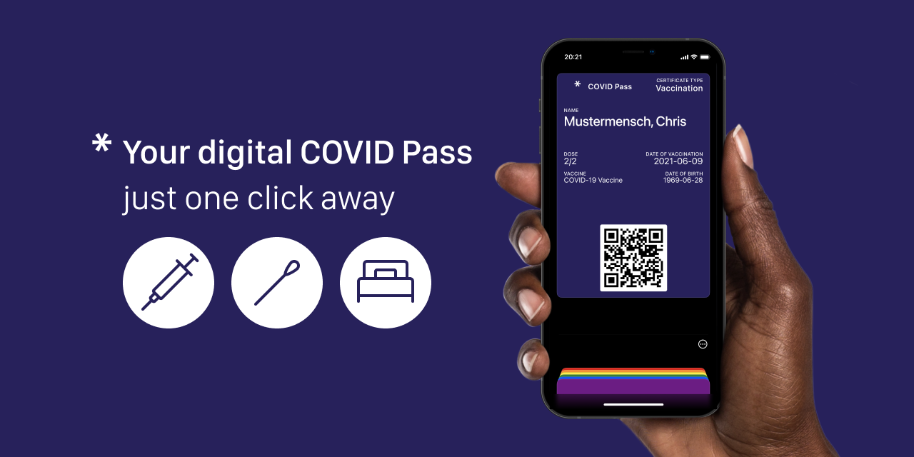
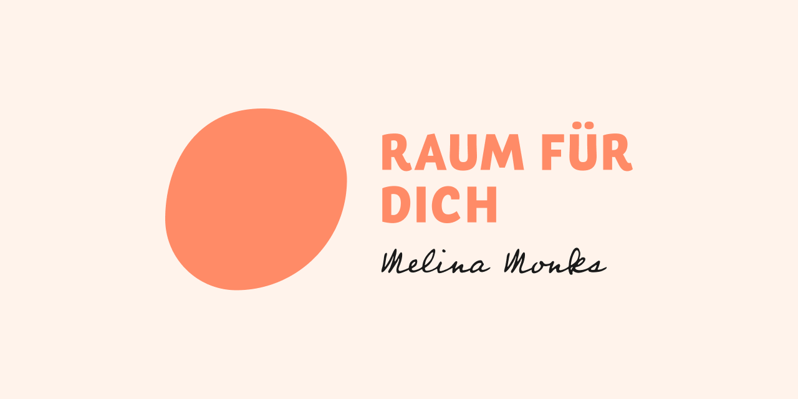

# Hi there ✌️

Glad you stopped by. You wonder who I am and what I do?

* I'm a **software developer** living near Berlin, Germany 📍
* I have a 💚 for open source, data privacy, UX and social engagement
* Always having some side projects going on and loving it 🤗

Do you want to connect, have questions or a job request? 

* 📧 [mail@philipptrenz.de](mailto:mail@philipptrenz.de)
* 📞 [+49 176 44553932](tel:+4917644553932)

Looking forward to hear from you! 🖖

## My favorite technologies

* [Vue](https://github.com/vuejs/vue) / [Nuxt.js](https://github.com/nuxt/nuxt.js) and [tailwindcss](https://github.com/tailwindlabs/tailwindcss) for web projects
* [django](https://github.com/django/django) and [Flask](https://github.com/pallets/flask) for APIs and database mapping
* [Flutter](https://github.com/flutter/flutter) and [SwiftUI](https://developer.apple.com/xcode/swiftui/) for apps
* [Kirby](https://github.com/getkirby/kirby) and [wagtail](https://github.com/wagtail/wagtail) for websites and CMS systems
* [kubernetes](https://kubernetes.io/de/) and [Apache Kafka](https://kafka.apache.org) for cloud services
* Python in general for data analysis, visualization and prototyping

## Current projects

Here comes a selection of my projects:

### covidpass.eu 

Together with UX designer [Donatus Wolf](https://www.linkedin.com/in/donatuswolf/), I built [COVID Pass](https://github.com/philipptrenz/covidpass). Since July 2021, we have been running the webapp, which generates an Apple Wallet pass from the digital EU COVID certificate in a privacy-friendly way in the browser. This means that the vaccination, recovery or even test certificate is always at hand with a double tap on your iPhone and Apple Watch. So far (as of Oct 2021) we have already generated over 80,000 passes, for free of course!

Check it out @ [covidpass.eu](https://covidpass.eu/)

### melinamonks.de

Melina Monks accompanies people in body awareness, childbearing and birth support. Based on the corporate design by the talented [Johanna Mellenthin](https://www.linkedin.com/in/johannamellenthin/), [Donatus Wolf](https://www.linkedin.com/in/donatuswolf/) designed the website. And I finally implemented it as a statically generated page with [Nuxt.js](https://github.com/nuxt/nuxt.js).

Check it out @ [melinamonks.de](http://melinamonks.de)

## Professional career

* Freelance software developer (since 2021)
* Master of Science in IT-Systems Engineering @ [Hasso-Plattner-Institute, Potsdam](https://hpi.de/en/) (2018-ongoing)
* Research Assistant in Computer Graphics @ [Hasso-Plattner-Institute, Potsdam](https://hpi.de/doellner/home.html) (2020-2021)
* Intern @ [Digital Masterpieces](https://www.digitalmasterpieces.com) (2020-2021)
* Bachelor of Science in *Media Informatics* @ [University of Applied Science Harz, Wernigerode](https://www.hs-harz.de/en/) (2014-2018)
* Intern in Automotive @ [AKKA Digital, Ingolstadt](https://www.akka-technologies.com/sector/empower-your-activities-with-digital-technologies/) (2017-2018)

## Voluntary Work

* Co-Founder & Dev @ [covidpass.eu](https://covidpass.eu) (2021-today)
* Support in IT and PR @ [casayohana Foundation (Germany)](https://casayohana.org) (2020-today)
* Network and IT System Administrator @ [casayohana (Campus Peru)](https://casayohana.org) (2019-today)