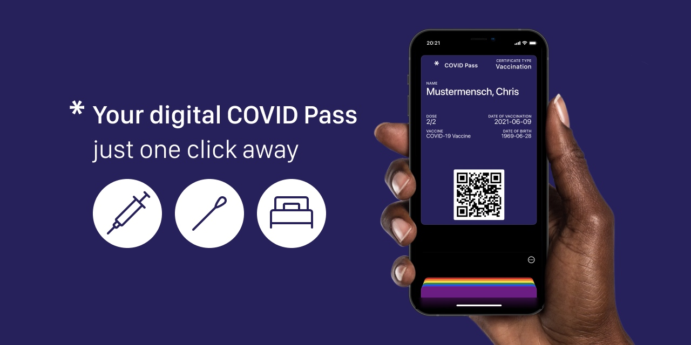

# Hi there ✌️

Glad you stopped by. You wonder what I do?

* I'm a **freelance software developer** living near Berlin, Germany 📍
* I have a 💚 for open source, data privacy, UX and social commitment
* Always having some side projects going on 🤗

Do you want to connect, have questions or even a job request? 

* 📧 [mail@philipptrenz.de](mailto:mail@philipptrenz.de)
* 📞 [+49 176 44553932](tel:+4917644553932)

Also feel free to add me on [LinkedIn](https://www.linkedin.com/in/philipp-trenz-a544a8182/). Looking forward to hear from you! 🖖

## Recent projects

### covidpass.eu 

Together with UX designer [Donatus Wolf](https://www.linkedin.com/in/donatuswolf/), I built [COVID Pass](https://github.com/philipptrenz/covidpass). Since July 2021, we have been running the webapp, which generates an Apple Wallet pass from the digital EU COVID certificate in a privacy-friendly way in the browser. This means that the vaccination, recovery or even test certificate is always at hand with a double tap on your iPhone and Apple Watch. So far (as of Oct 2021) we have already generated over 80,000 passes, for free of course!

Check it out @ [covidpass.eu](https://covidpass.eu/)

### podcast2phone.de

podcast2phone offers podcast producers and media houses the possibility to offer their audio on demand content to people who have limited or no access to digital services. With this cloud software, podcasts and individual audio episodes can be conveniently connected to our cloud telephone infrastructure via a web interface. Set up in just a few minutes your audio content, otherwise only available digitally, can now be listened to on the probably most common audio device: The phone.

The project was developed together with UX designers [Marius Classen](https://www.linkedin.com/in/claßen/) and [Donatus Wolf](https://www.linkedin.com/in/donatuswolf/).

### melinamonks.de

Melina Monks accompanies people in body awareness, wish for children and birth support. Based on the corporate design by [Johanna Mellenthin](https://www.linkedin.com/in/johannamellenthin/), [Donatus Wolf](https://www.linkedin.com/in/donatuswolf/) designed the website. And I finally implemented it as a statically generated page with [Nuxt.js](https://github.com/nuxt/nuxt.js).

Check it out @ [melinamonks.de](https://melinamonks.de)

## Career

* 👨‍💼 Freelance software developer (since 2021)
* 👨‍🎓 Master of Science in *IT-Systems Engineering* @ [Hasso-Plattner-Institute, Potsdam (Germany)](https://hpi.de/en/) (2018-ongoing)
* 👨‍🔬 Research Assistant in *Computer Graphics* @ [Hasso-Plattner-Institute, Potsdam (Germany)](https://hpi.de/doellner/home.html) (2020-2021)
* 👨‍💻 Intern in *Computer Graphics* / *iOS Development* @ [Digital Masterpieces, Potsdam (Germany)](https://www.digitalmasterpieces.com) (2020-2021)
* 👨‍🎓 Bachelor of Science in *Media Informatics* @ [Harz University, Wernigerode (Germany)](https://www.hs-harz.de/en/) (2014-2018) 
* 👨‍💻 Intern in *Automotive* / *Computer Graphics* @ [AKKA Digital, Ingolstadt (Germany)](https://www.akka-technologies.com/sector/empower-your-activities-with-digital-technologies/) (2017-2018) 

## Voluntary Work

* 💁‍♂️ Co-Founder & Dev @ [covidpass.eu](https://covidpass.eu) (2021-today)
* 🙆‍♂️ Support in IT and PR @ [casayohana Foundation (Germany)](https://casayohana.org) (2020-today)
* 🙋‍♂️ Network and IT System Administrator @ [casayohana (Peru)](https://casayohana.org) (2019-today)

## My favorite technologies

* 🏠 [Kirby](https://github.com/getkirby/kirby) and [wagtail](https://github.com/wagtail/wagtail) for websites and CMS
* 👔 [Vue.js](https://github.com/vuejs/vue) / [Nuxt.js](https://github.com/nuxt/nuxt.js) and [tailwindcss](https://github.com/tailwindlabs/tailwindcss) for web projects
* 📡 [Django](https://github.com/django/django) and [Flask](https://github.com/pallets/flask) for APIs and database mapping
* 📱 [Flutter](https://github.com/flutter/flutter) and [SwiftUI](https://developer.apple.com/xcode/swiftui/) for apps
* ☁️ [kubernetes](https://kubernetes.io/de/) and [Apache Kafka](https://kafka.apache.org) for cloud services
* 🐍 Python in general for data analysis, visualization and prototyping
